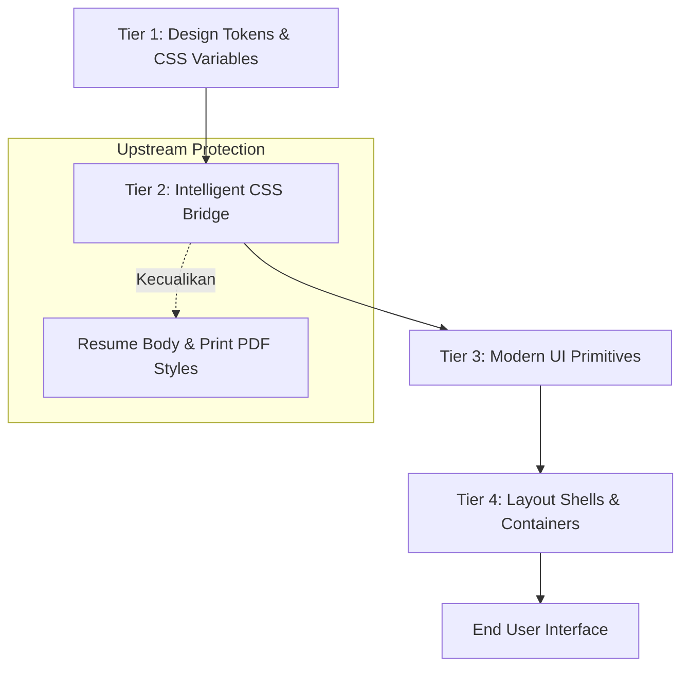
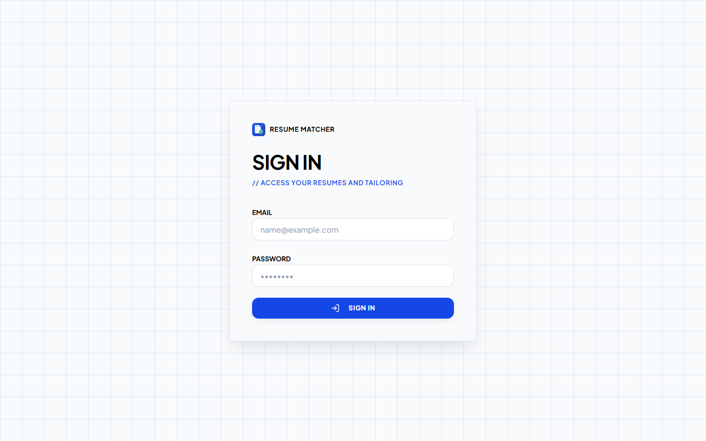
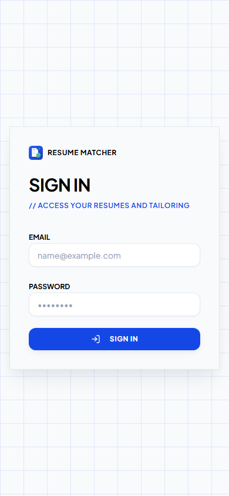
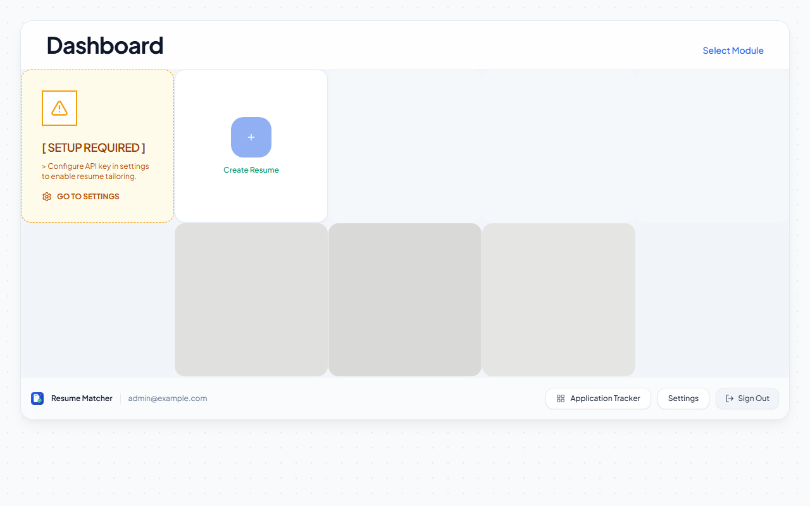
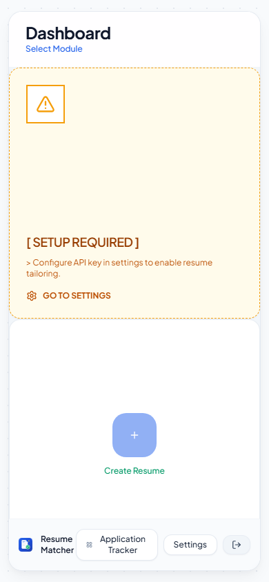
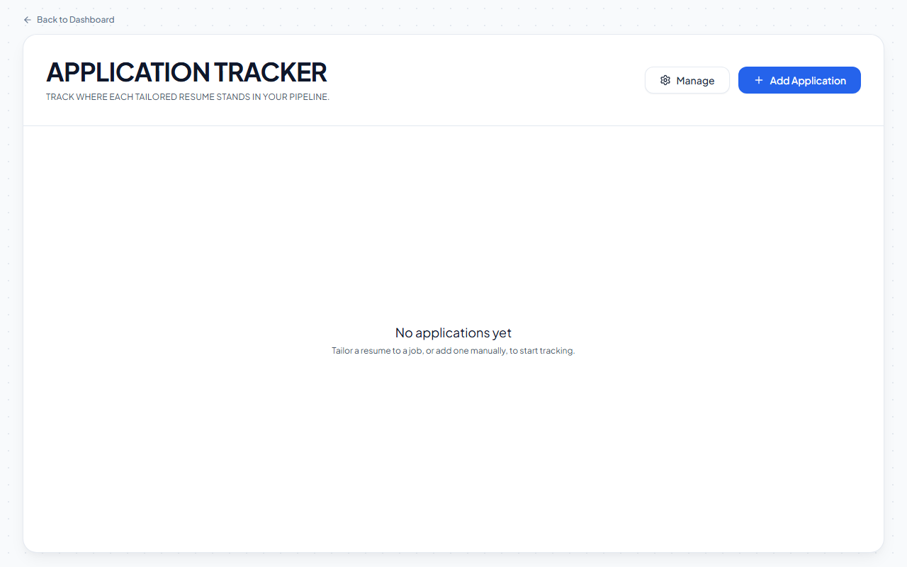
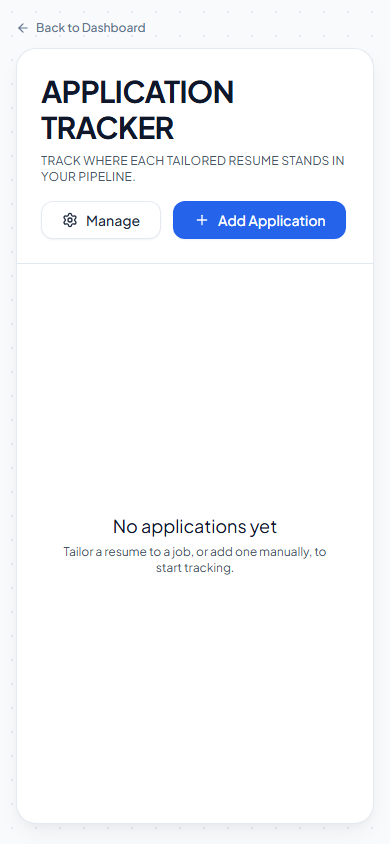
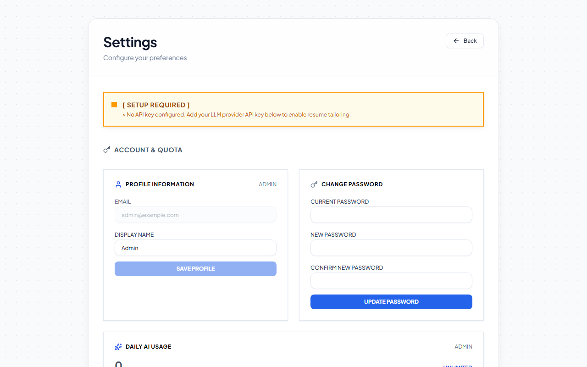
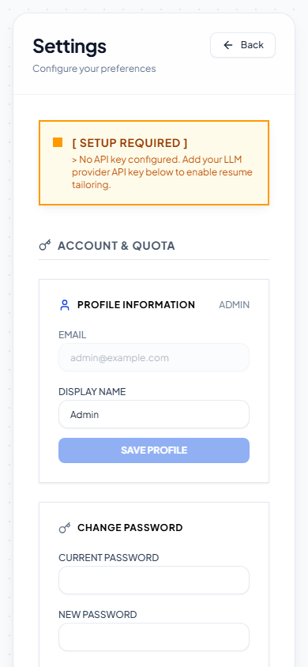

# Laporan Desain & Visual QA: Redesign Modern-Minimalis Resume Matcher

- **Proyek:** Resume Matcher (Multi-User Fork)
- **Target Branch:** `fork/phase-7-deployment` (Commit: `f956e1f`)
- **Desain Skill:** `/design-taste-frontend-v1`
- **Tanggal:** 6 Oktober 2026
- **Status:** **Disetujui, Diimplementasikan Penuh, & Lulus QA 100%**

---

## 1. Ringkasan Eksekutif

Proyek ini bertujuan mentransformasi antarmuka pengguna (UI/UX) Resume Matcher dari gaya **Swiss Neo-Brutalist** (border hitam 2px, sudut tajam 0px, drop shadow kaku 4px) menjadi gaya **Modern-Minimalis Studio** (Clean, Calm, High-End SaaS seperti Linear, Stripe, dan Vercel). 

Transformasi ini dilakukan dengan strategi **4-Tier Architecture** yang meminimalkan perubahan langsung pada file page upstream, sehingga aman terhadap konflik Git saat melakukan sinkronisasi dengan upstream master (`srbhr/Resume-Matcher`).

Seluruh pengujian fungsionalitas, kompilasi TypeScript (`tsc --noEmit`), build produksi Next.js 16 (`next build`), serta visual testing responsif (Desktop & Mobile) telah diselesaikan dengan **0 galat dan 0 horizontal scroll overflow**.

---

## 2. Arsitektur Redesign (Upstream-Safe)

Untuk menjaga kompatibilitas upstream tanpa menyentuh puluhan file halaman bawaan yang rentan merge conflict, redesign diimplementasikan melalui 4 lapisan:



1. **Tier 1 — Design Tokens (`globals.css`):**
   - Mendefinisikan hierarki radius terstruktur (`--radius-sm: 6px`, `--radius-md: 8px`, `--radius-lg: 12px`, `--radius-xl: 16px`, `--radius-2xl: 20px`).
   - Mendefinisikan *ambient multi-tier shadows* dengan Gaussian blur alami menggantikan shadow keras tanpa blur.
   - Mengatur palet warna berbasis Slate (`slate-50` hingga `slate-900`) dan Primary Blue (`#1d4ed8` / `#2563eb`).

2. **Tier 2 — Intelligent CSS Bridge (`globals.css`):**
   - Menggunakan selektor cerdas `:where(:not(.resume-body, .resume-print, .cover-letter-print) .border-black)` untuk otomatis melembutkan border hitam lama menjadi `border-slate-200/80` tanpa perlu mengubah kode JSX upstream.
   - **Perlindungan Dokumen Print:** Menjaga format cetak resume (`.resume-body`, `@media print`) tetap 100% sesuai standar ATS tanpa perubahan gaya.

3. **Tier 3 — Modern UI Primitives (`components/ui/*`):**
   - Memodernisasi 13 komponen fundamental: `Button`, `Card`, `Input`, `Textarea`, `Dialog`, `ConfirmDialog`, `Dropdown`, `RetroTabs`, `ToggleSwitch`, `RichTextEditor`, `RichTextToolbar`, `LinkDialog`, dan `Label`.
   - Mengganti bayangan kaku dengan transisi *soft hover elevation* dan *focus rings* kontras tinggi yang ramah aksesibilitas.

4. **Tier 4 — Layout Shells:**
   - Memperbarui `swiss-grid.tsx` dengan latar belakang *dot matrix grid* halus.
   - Merapikan header, navigation dock, dan card container pada `/dashboard`, `/tracker`, `/settings`, dan `/tailor`.

---

## 3. Hasil Pengujian Responsivitas & Visual QA

Pengujian otomatis dilakukan menggunakan Playwright (Chromium Headless) dengan akun terotentikasi penuh (`admin@example.com`).

### Matriks Hasil Evaluasi Viewport

| Halaman | Resolusi Desktop (1280x800) | Resolusi Mobile (390x844 - iPhone) | Evaluasi Horizontal Overflow | Status QA |
| :--- | :--- | :--- | :--- | :--- |
| **`/login`** | Rapi terpusat di tengah layar | Card memanjang proporsional, input nyaman di-*tap* | **False** (0px) | **LULUS** |
| **`/dashboard`** | Dock bawah terorganisir, tile modular | Tile menumpuk rapi, bottom dock adaptif | **False** (0px) | **LULUS** |
| **`/tracker`** | Header sejajar, empty-state luas | Aksi berdampingan simetris, bebas teks patah | **False** (0px) | **LULUS** |
| **`/settings`** | Grid 2 kolom berimbang | Single-column form stack yang ergonomis | **False** (0px) | **LULUS** |

> **Catatan Pengujian:** Evaluasi `document.documentElement.scrollWidth > document.documentElement.clientWidth` mengembalikan `false` di seluruh halaman pada kedua ukuran layar, membuktikan bahwa antarmuka bebas dari glitch pergeseran horizontal (horizontal scrolling bug).

---

## 4. Dokumentasi Visual Hasil Redesign

### 4.1. Halaman Login (`/login`)
Antarmuka login dengan panel terpusat, input dengan *subtle rounded border*, dan tombol aksi biru modern dengan ikon navigasi yang jelas.

| Desktop (1280x800) | Mobile (390x844) |
| :---: | :---: |
|  |  |

---

### 4.2. Dashboard Utama (`/dashboard`)
Panel kerja dengan container rounded-2xl, kartu status setup bernuansa amber lembut, tombol aksi tile modular, dan navigation dock bawah yang elegan.

| Desktop (1280x800) | Mobile (390x844) |
| :---: | :---: |
|  |  |

---

### 4.3. Application Tracker (`/tracker`)
Kanban / pipeline pelacak lamaran kerja dengan tipografi header modern, tombol navigasi cepat, dan area data yang lapang.

| Desktop (1280x800) | Mobile (390x844) |
| :---: | :---: |
|  |  |

---

### 4.4. Pengaturan Akun & Profil (`/settings`)
Form manajemen profil, ganti kata sandi, dan kuota pemakaian harian AI dengan tata letak kartu terpisah yang terstruktur rapi.

| Desktop (1280x800) | Mobile (390x844) |
| :---: | :---: |
|  |  |

---

## 5. Ringkasan Perubahan File

- **Design System & CSS Global:**
  - `apps/frontend/app/(default)/css/globals.css`: Penambahan token radius, shadow diffusion, dan Intelligent CSS Bridge.
- **Komponen UI Primitif:**
  - `apps/frontend/components/ui/button.tsx`
  - `apps/frontend/components/ui/card.tsx`
  - `apps/frontend/components/ui/input.tsx`
  - `apps/frontend/components/ui/textarea.tsx`
  - `apps/frontend/components/ui/dialog.tsx`
  - `apps/frontend/components/ui/confirm-dialog.tsx`
  - `apps/frontend/components/ui/dropdown.tsx`
  - `apps/frontend/components/ui/retro-tabs.tsx`
  - `apps/frontend/components/ui/toggle-switch.tsx`
  - `apps/frontend/components/ui/rich-text-editor.tsx`
  - `apps/frontend/components/ui/rich-text-toolbar.tsx`
  - `apps/frontend/components/ui/link-dialog.tsx`
  - `apps/frontend/components/ui/label.tsx`
- **Layout Shells:**
  - `apps/frontend/components/common/swiss-grid.tsx`
  - `apps/frontend/components/marketing/hero.tsx`
  - `apps/frontend/app/(default)/dashboard/page.tsx`
  - `apps/frontend/app/(default)/tracker/page.tsx`
  - `apps/frontend/app/(default)/settings/page.tsx`
  - `apps/frontend/app/(default)/tailor/page.tsx`

---

## 6. Panduan Pengujian Lokal (Verifikasi Mandiri)

Bagi pengembang yang ingin menjalankan dan menguji antarmuka ini secara lokal:

1. **Jalankan Backend (FastAPI):**
   ```bash
   cd apps/backend
   .\.venv\Scripts\python.exe -m uvicorn app.main:app --port 8000 --host 127.0.0.1
   ```
2. **Jalankan Frontend Standalone:**
   ```bash
   cd apps/frontend
   node .next/standalone/server.js
   ```
3. **Buka Aplikasi:**
   - URL: `http://localhost:3000`
   - Email: `admin@example.com`
   - Password: `Password123!`
