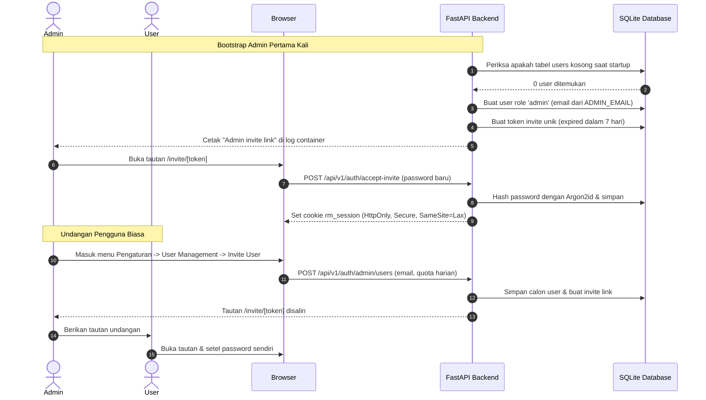
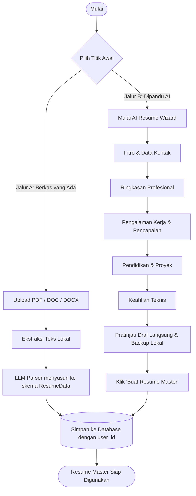
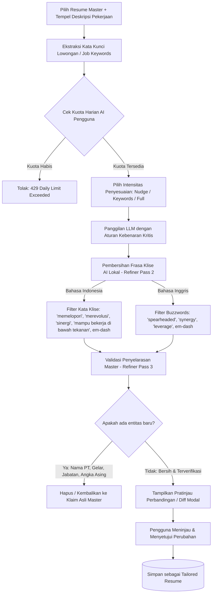
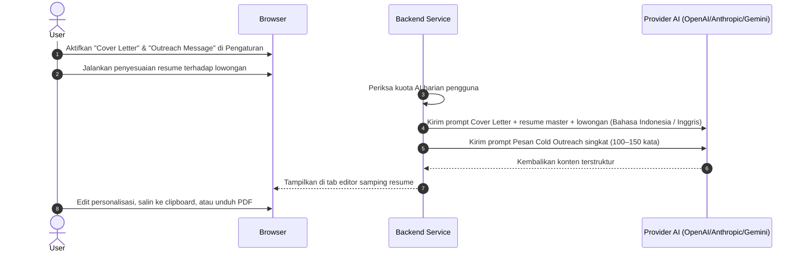
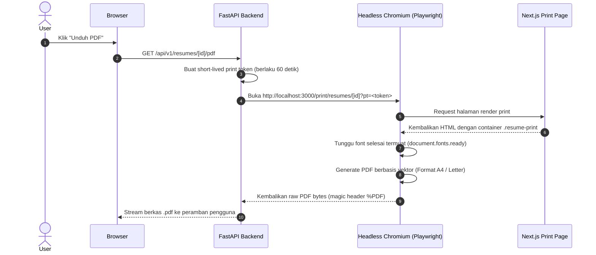

# Arsitektur Alur Sistem (System Flows) & Spesifikasi VPS

> Dokumen komprehensif mengenai seluruh alur kerja sistem (*end-to-end flows*) pada Resume Matcher Fork, serta panduan spesifikasi minimum VPS untuk deployment produksi di Dokploy.

---

## 1. Spesifikasi Minimum & Rekomendasi VPS

Resume Matcher adalah aplikasi fullstack yang menggabungkan Next.js (Node.js runtime), FastAPI (Python 3.13), basis data SQLite embedded, dan **Headless Chromium (Playwright)** untuk rendering PDF berstandar ATS.

Komponen yang paling memakan resource adalah:
1. **Docker Build**: Proses kompilasi Next.js (`npm run build`) saat deploy membutuhkan lonjakan memori (RAM peak).
2. **Headless Chromium**: Setiap eksekusi unduh PDF menjalankan browser headless untuk merender dokumen beresolusi tinggi.

### Tabel Spesifikasi Hardware VPS

| Komponen | Spesifikasi Minimum (Personal / 1–3 User) | Spesifikasi Rekomendasi (5–15 User Aktif) | Catatan Penting |
|---|---|---|---|
| **vCPU** | 2 Core | 2–4 Core | Rendering PDF dan parsing teks memanfaatkan CPU secara intensif. |
| **RAM** | 2 GB | 4 GB | Kurang dari 2 GB sangat rentan terhadap *Out of Memory* (OOM). |
| **SWAP** | **2 GB (Wajib dibuat)** | **2–4 GB** | **Sangat krusial** mencegah kegagalan build `npm run build` dan crash Chromium. |
| **Penyimpanan (Storage)** | 20 GB SSD / NVMe | 40 GB SSD / NVMe | Ruang untuk Docker image layers, cache build, database, dan backups. |
| **Sistem Operasi** | Ubuntu 22.04 / 24.04 LTS atau Debian 12 | Ubuntu 24.04 LTS / Debian 12 | Kompatibel penuh dengan Dokploy dan runtime Docker modern. |
| **Jaringan (Bandwidth)** | 1 Gbps port, kuota 1 TB/bulan | 1 Gbps port, kuota 2+ TB/bulan | Koneksi stabil ke API penyedia LLM (OpenAI, Gemini, dll.). |

> [!IMPORTANT]
> ### Panduan Menambahkan Swap Memory di VPS (Wajib untuk RAM 2 GB)
> Jika VPS Anda memiliki RAM 2 GB, pastikan swap diaktifkan agar proses build Docker tidak terkena *Linux OOM Killer*:
> ```bash
> # Jalankan perintah ini di SSH host VPS Anda:
> sudo fallocate -l 2G /swapfile
> sudo chmod 600 /swapfile
> sudo mkswap /swapfile
> sudo swapon /swapfile
> echo '/swapfile none swap sw 0 0' | sudo tee -a /etc/fstab
> ```

---

## 2. Peta Alur Sistem (System Flows)

Berikut adalah 8 alur kerja utama di dalam Resume Matcher:

```
┌────────────────────────────────────────────────────────────────────────┐
│                        RESUME MATCHER WORKFLOWS                        │
├────────────────────────────────────────────────────────────────────────┤
│                                                                        │
│  [1. Auth & Tenancy] ────────► [2. Resume Master Creation]             │
│   - Login / Sesi Cookie         - Upload File (PDF/DOCX)               │
│   - Admin Bootstrap             - AI Resume Wizard (Bahasa Indonesia)  │
│   - Isolasi Multi-User          - Penyimpanan Terstruktur              │
│                                           │                            │
│                                           ▼                            │
│  [5. Tracker & Evaluasi] ◄──── [3. Job Tailoring & Anti-Fabrication]   │
│   - Kanban Lamaran              - Job Keywords Matching                │
│   - Analisis JD Match           - Filter Frasa Klise Indonesia         │
│   - Persiapan Wawancara         - Master Alignment (Anti-Halusinasi)   │
│                                           │                            │
│                                           ▼                            │
│  [7. Dokumen Tambahan]   ◄──── [4. ATS PDF Rendering & Export]         │
│   - Cover Letter                - Headless Chromium Vector PDF         │
│   - Cold Outreach Mail          - Verified Reading Order pdfminer.six  │
│                                                                        │
└────────────────────────────────────────────────────────────────────────┘
```

---

### Alur 1: Bootstrap & Autentikasi Pengguna (Auth & Tenancy)



**Karakteristik Keamanan:**
- Cookie sesi `rm_session` ditandatangani menggunakan HMAC-SHA256 dengan rotasi key aman.
- Rate limiting ketat pada endpoint login (5 percobaan / 15 menit per IP) dan validasi invite token (10 percobaan / jam).
- Seluruh mutasi state memvalidasi header `Origin` untuk mencegah serangan CSRF.

---

### Alur 2: Pembuatan & Parsing Resume Master

Ada dua jalur untuk menyiapkan resume master:



- **Penyimpanan Lokal:** Draf wizard otomatis disimpan di browser local storage untuk mencegah kehilangan pekerjaan jika koneksi terputus.
- **Dukungan Multi-Master:** Pengguna dapat memiliki lebih dari satu jalur master resume (misal: satu untuk fokus *Backend Developer*, satu untuk *DevOps / SRE*).

---

### Alur 3: Penyesuaian Resume Berbasis Lowongan (Tailoring & Anti-Fabrication)

Alur utama dalam menyelaraskan resume terhadap lowongan kerja dengan penjagaan ketat agar AI tidak mengarang bebas (*hallucination / fabrication*):



**Mekanisme Anti-Fabrikasi:**
1. **Prompt Truthfulness Rules**: Instruksi mutlak bagi LLM bahwa resume master adalah *single source of truth*.
2. **Deterministic Phrase Removal**: Menghapus frasa AI yang terdeteksi secara lokal (tanpa memotong kata kunci yang memang ada di dalam deskripsi lowongan).
3. **Master Alignment Verification**: Kode backend secara terprogram membandingkan setiap nama perusahaan, gelar akademik, dan angka metrik baru dengan data master resume.

---

### Alur 4: Pembuatan Cover Letter & Pesan Outreach



---

### Alur 5: Evaluasi Kesesuaian (JD Match) & Persiapan Wawancara

- **JD Match Analysis**:
  - Menganalisis tingkat keselarasan kata kunci (*match score*).
  - Menyorot (*highlight*) kata kunci yang cocok secara langsung pada tampilan resume dengan penanda visual.
  - Memberikan daftar saran kata kunci teknis yang belum tercakup di resume.
- **Interview Preparation**:
  - Menghasilkan daftar pertanyaan wawancara yang spesifik berdasarkan proyek nyata dan riwayat pekerjaan di resume.
  - Memberikan panduan jawaban berbasis bukti (*grounded answer points*) tanpa mengarang pengalaman yang tidak ada.

---

### Alur 6: Rendering PDF & Verifikasi ATS (Ekspor Dokumen)

Proses pembuatan berkas PDF asli yang menjamin struktur teks dapat dibaca oleh sistem ATS perusahaan:



**Jaminan Keterbacaan ATS:**
- Tata letak default menggunakan `swiss-single` satu kolom (standar industri paling aman untuk parser ATS).
- Telah diuji menggunakan library ekstraksi teks `pdfminer.six` untuk menjamin *linear reading order* (nama -> judul -> ringkasan -> riwayat kerja -> pendidikan -> keahlian).

---

### Alur 7: Pelacak Lamaran (Application Tracker)

Papan Kanban interaktif untuk mengelola perjalanan pencarian kerja:

```
┌───────────┐    ┌───────────┐    ┌─────────────┐    ┌───────────┐    ┌───────────┐    ┌───────────┐
│   SAVED   │───►│  APPLIED  │───►│ NO RESPONSE │───►│ RESPONSE  │───►│ INTERVIEW │───►│ ACCEPTED  │
│  Disimpan │    │ Terkirim  │    │  (Followup) │    │ Ada Balas │    │ Wawancara │    │  Diterima │
└───────────┘    └───────────┘    └─────────────┘    └───────────┘    └───────────┘    └───────────┘
                                                                                             │
                                                                                             ▼
                                                                                       ┌───────────┐
                                                                                       │ REJECTED  │
                                                                                       │  Ditolak  │
                                                                                       └───────────┘
```
- Setiap kartu terhubung langsung dengan ID resume yang digunakan dan deskripsi pekerjaan yang dilamar.
- Dilengkapi kolom catatan pribadi untuk mencatat kontak perekrut atau jadwal tes teknis.

---

### Alur 8: Isolasi Multi-User, Kuota Harian, & Penghapusan Mandiri

- **Isolasi Data Multitenant:**
  Setiap baris data pada tabel `resumes`, `jobs`, `applications`, `resume_tailor_sessions`, dan `application_tracker` terikat pada kolom `user_id`. Backend secara otomatis menolak akses antar-pengguna dengan status `404 Not Found` (mencegah enumerasi ID).
- **Reset Kuota Harian:**
  Batas operasi AI (misal 30 operasi/hari) direset setiap pukul 00:00 WIB (Waktu Indonesia Barat / Asia/Jakarta).
- **Penghapusan Data Mandiri (*Self Data Deletion*):**
  Pengguna memiliki kendali privasi penuh melalui tombol "Delete All My Data" di menu Akun. Mengetik `RESET_ALL_DATA` akan menghapus seluruh resume, riwayat penyesuaian, dan lamaran milik pengguna secara permanen dan bersih (*cascading delete*).

---

## 3. Ringkasan Kebutuhan Deployment Produksi (Dokploy)

| Kebutuhan | Nilai Konfigurasi | Lokasi Pengaturan |
|---|---|---|
| **Domain** | `cv.zen-ai.my.id` | Tab **Domains** di Dokploy |
| **Port Container** | `3000` | Tab **Domains** di Dokploy |
| **SSL / HTTPS** | Aktif (Let's Encrypt Traefik) | Centang SSL di tab **Domains** |
| **Persistent Volume** | `resume-matcher-data` -> `/app/backend/data` | Tab **Volumes** di Dokploy |
| **Admin Email** | `zaenalarifmagang@gmail.com` | Tab **Environment** di Dokploy |
| **Public Base URL** | `https://cv.zen-ai.my.id` | Tab **Environment** di Dokploy |
| **CORS Origins** | `["https://cv.zen-ai.my.id"]` | Tab **Environment** di Dokploy |
| **Reverse Proxy Header** | `TRUST_PROXY=true` | Tab **Environment** di Dokploy |
